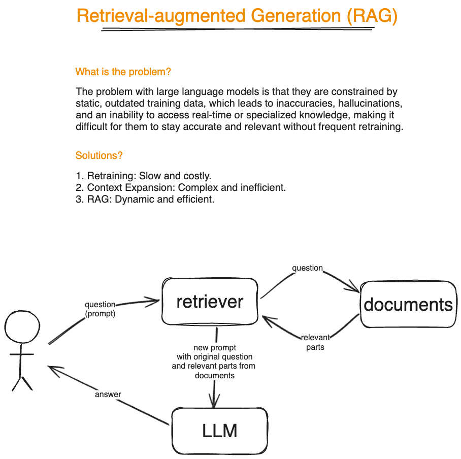

# GenAI Hack Day Project: RAG-based CLI Tool

A simple CLI tool that uses Retrieval-Augmented Generation (RAG) to read local files, store them in a memory vector store, and answer questions in a chat-like interface.

## Usage

Make sure ollama is running

```
docker compose up
```

Before the first run, download the models

```
docker compose exec ollama ollama pull llama3.2
docker compose exec ollama ollama pull mxbai-embed-large
```

Run the tool

```
npm start <directory> # npm start docs1
```

## Presentation


